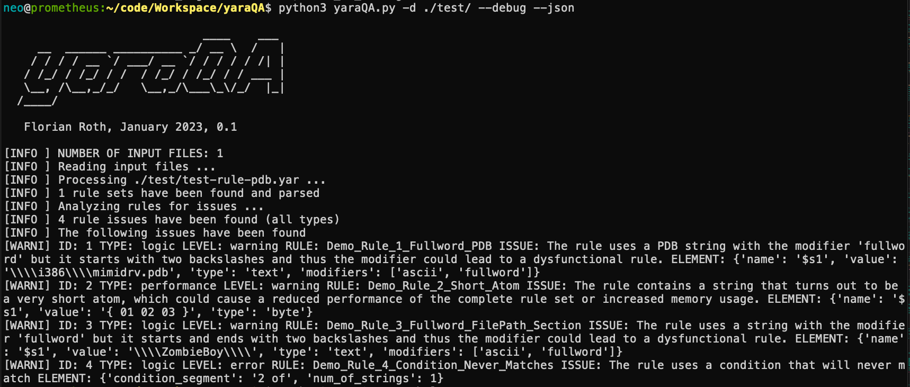

# yaraQA
YARA rule Analyzer to improve rule quality and performance

## Why?

YARA rules can be syntactically correct but still dysfunctional. yaraQA tries to find and report these issues to the author or maintainer of a YARA rule set.

The issues yaraQA tries to detect are e.g.:

- rules that are syntactically correct but never match due to errors in the condition (e.g. rule with one string and `2 of them` in the condition)
- rules that use string and modifier combinations that are probably wrong (e.g. `$ = "\\Debug\\" fullword`)
- performance issues caused by short atoms, repeating characters or loops (e.g. `$ = "AA"`; can be excluded from the analysis using `--ignore-performance`)

I'm going to extend the test set over time. Each minor version will include new features or new tests.

## Install requirements

```bash
pip install -r requirements.txt
```

## Usage

```bash
usage: yaraQA.py [-h] [-f yara files [yara files ...]] [-d yara files [yara files ...]] [-o outfile] [-b baseline] [-l level]
                 [--ignore-performance] [--debug]

YARA RULE ANALYZER

optional arguments:
  -h, --help            show this help message and exit
  -f yara files [yara files ...]
                        Path to input files (one or more YARA rules, separated by space)
  -d yara files [yara files ...]
                        Path to input directory (YARA rules folders, separated by space)
  -o outfile            Output file that lists the issues (JSON, default: 'yaraQA-issues.json') 
  -b baseline           Use a issues baseline (issues found and reviewed before) to filter issues
  -l level              Minium level to show (1=informational, 2=warning, 3=critical)
  --ignore-performance  Suppress performance-related rule issues
  --debug               Debug output
```

## Try it out

```bash
python3 yaraQA.py -d ./test/
```

Suppress all performance issues and only show detection / logic issues.
```bash
python3 yaraQA.py -d ./test/ --ignore-performance
```

Suppress all issues of informational character
```bash
python3 yaraQA.py -d ./test/ -level 2
```

Use a baseline to only see new issues (not the ones that you've already reviewed). The baseline file is an old JSON output of a reviewed state.

```bash
python3 yaraQA.py -d ./test/ -b yaraQA-reviewed-issues.json
```

## Example Rules with Issues

Example rules with issues can be found in the `./test` folder.

## Output

yaraQA writes the detected issues to a file named `yaraQA-issues.json` by default.

This listing shows an example of the output generated by yaraQA in JSON format:

```json
[
    {
        "rule": "Demo_Rule_1_Fullword_PDB",
        "id": "SM1",
        "issue": "The rule uses a PDB string with the modifier 'wide'. PDB strings are always included as ASCII strings. The 'wide' keyword is unneeded.",
        "element": {
            "name": "$s1",
            "value": "\\\\i386\\\\mimidrv.pdb",
            "type": "text",
            "modifiers": [
                "ascii",
                "wide",
                "fullword"
            ]
        },
        "level": "info",
        "type": "logic",
        "recommendation": "Remove the 'wide' modifier"
    },
    {
        "rule": "Demo_Rule_1_Fullword_PDB",
        "id": "SM2",
        "issue": "The rule uses a PDB string with the modifier 'fullword' but it starts with two backslashes and thus the modifier could lead to a dysfunctional rule.",
        "element": {
            "name": "$s1",
            "value": "\\\\i386\\\\mimidrv.pdb",
            "type": "text",
            "modifiers": [
                "ascii",
                "wide",
                "fullword"
            ]
        },
        "level": "warning",
        "type": "logic",
        "recommendation": "Remove the 'fullword' modifier"
    },
    {
        "rule": "Demo_Rule_2_Short_Atom",
        "id": "PA2",
        "issue": "The rule contains a string that turns out to be a very short atom, which could cause a reduced performance of the complete rule set or increased memory usage.",
        "element": {
            "name": "$s1",
            "value": "{ 01 02 03 }",
            "type": "byte"
        },
        "level": "warning",
        "type": "performance",
        "recommendation": "Try to avoid using such short atoms, by e.g. adding a few more bytes to the beginning or the end (e.g. add a binary 0 in front or a space after the string). Every additional byte helps."
    },
    {
        "rule": "Demo_Rule_3_Fullword_FilePath_Section",
        "id": "SM3",
        "issue": "The rule uses a string with the modifier 'fullword' but it starts and ends with two backslashes and thus the modifier could lead to a dysfunctional rule.",
        "element": {
            "name": "$s1",
            "value": "\\\\ZombieBoy\\\\",
            "type": "text",
            "modifiers": [
                "ascii",
                "fullword"
            ]
        },
        "level": "warning",
        "type": "logic",
        "recommendation": "Remove the 'fullword' modifier"
    },
    {
        "rule": "Demo_Rule_4_Condition_Never_Matches",
        "id": "CE1",
        "issue": "The rule uses a condition that will never match",
        "element": {
            "condition_segment": "2 of",
            "num_of_strings": 1
        },
        "level": "error",
        "type": "logic",
        "recommendation": "Fix the condition"
    },
    {
        "rule": "Demo_Rule_5_Condition_Short_String_At_Pos",
        "id": "PA1",
        "issue": "This rule looks for a short string at a particular position. A short string represents a short atom and could be rewritten to an expression using uint(x) at position.",
        "element": {
            "condition_segment": "$mz at 0",
            "string": "$mz",
            "value": "MZ"
        },
        "level": "warning",
        "type": "performance",
        "recommendation": ""
    },
    {
        "rule": "Demo_Rule_5_Condition_Short_String_At_Pos",
        "id": "PA2",
        "issue": "The rule contains a string that turns out to be a very short atom, which could cause a reduced performance of the complete rule set or increased memory usage.",
        "element": {
            "name": "$mz",
            "value": "MZ",
            "type": "text",
            "modifiers": [
                "ascii"
            ]
        },
        "level": "warning",
        "type": "performance",
        "recommendation": "Try to avoid using such short atoms, by e.g. adding a few more bytes to the beginning or the end (e.g. add a binary 0 in front or a space after the string). Every additional byte helps."
    },
    {
        "rule": "Demo_Rule_6_Condition_Short_Byte_At_Pos",
        "id": "PA1",
        "issue": "This rule looks for a short string at a particular position. A short string represents a short atom and could be rewritten to an expression using uint(x) at position.",
        "element": {
            "condition_segment": "$mz at 0",
            "string": "$mz",
            "value": "{ 4d 5a }"
        },
        "level": "warning",
        "type": "performance",
        "recommendation": ""
    },
    {
        "rule": "Demo_Rule_6_Condition_Short_Byte_At_Pos",
        "id": "PA2",
        "issue": "The rule contains a string that turns out to be a very short atom, which could cause a reduced performance of the complete rule set or increased memory usage.",
        "element": {
            "name": "$mz",
            "value": "{ 4d 5a }",
            "type": "byte"
        },
        "level": "warning",
        "type": "performance",
        "recommendation": "Try to avoid using such short atoms, by e.g. adding a few more bytes to the beginning or the end (e.g. add a binary 0 in front or a space after the string). Every additional byte helps."
    },
    {
        "rule": "Demo_Rule_6_Condition_Short_Byte_At_Pos",
        "id": "SM3",
        "issue": "The rule uses a string with the modifier 'fullword' but it starts and ends with two backslashes and thus the modifier could lead to a dysfunctional rule.",
        "element": {
            "name": "$s1",
            "value": "\\\\Section\\\\in\\\\Path\\\\",
            "type": "text",
            "modifiers": [
                "ascii",
                "fullword"
            ]
        },
        "level": "warning",
        "type": "logic",
        "recommendation": "Remove the 'fullword' modifier"
    }
]
```

## Screenshots


